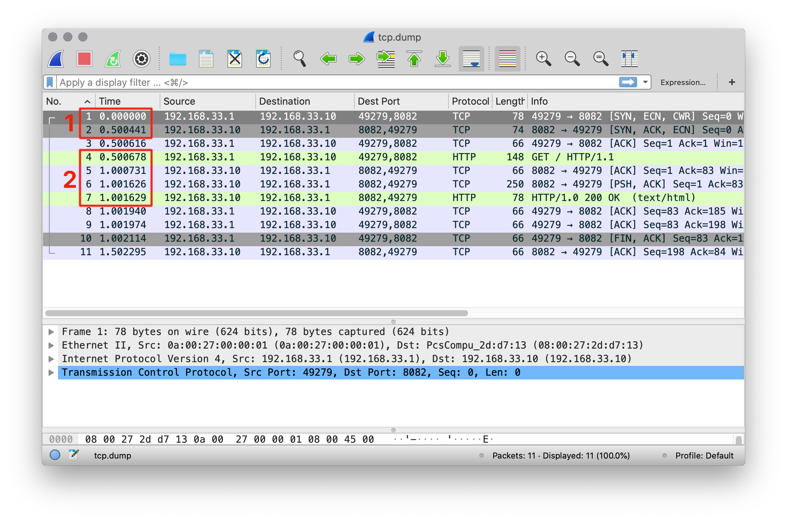

Find out how lost or delayed traffic affects your application with our network attacks. Test how your service behaves when it can't reach the required resources internally or externally. You can limit the effects by specifying host names, IP addresses or port numbers.

> All attacks can have a **Host** or a **Container** as their target, the configuration is the same. 
> If you are not using our container images for the agents, you need install the `tc` (from the iproute2 package) tool to attack **Hosts**.

> If you are going to attack containers using network attacks, **all containers in the target's namespace** (e.g. all containers belonging to the same Kubernetes Pod or Replica Set) will be affected.
> In case you want to target the traffic of a single container in the namespace you can for example use the port parameter to limit the blast radius.

## Delay Traffic
Inject latency into all matching traffic.

This attack can be adjusted using the following parameters and the effects can be limited.

| Parameter   |      Description      | Default |
|----------|-------------|-------------|
| Duration |  How long should the traffic be delayed? | 30s |
| Hostname |    Restrict to which hosts the traffic is delayed   | |
| IP Address | Restrict to which IP address the traffic is delayed | |
| Network Delay | How much should the traffic be delayed? | 500ms |
| Network Interface | Target Network Interface which should be attacked | eth0 |
| Port Number | Restrict to which port number the traffic is delayed | |
| Jitter | Random +-30% jitter to network delay | true |

The network delay operates at the ip level and affects single packets.
Thus you may encounter http requests that are delayed by a multiple of the specified delay.

In this example the traffic is delayed by 500ms.
If you tap the wire (using tcpdump) and feed it into Wireshark it looks like this:

1. The first incoming packet initiates the tcp connection and is accepted by the second packet, which is delayed exactly be the 500ms.  
2. With the fourth packet we receive an http request in the payload. Which is acknowledged and answered with an http response in packet four to seven, which are also delayed by 500ms and thus the total latency for the http request sums up to 1 second.

## Drop Traffic
Drops all matching network traffic.

This attack can be adjusted using the following parameters and the effects can be limited.

| Parameter   |      Description      | Default |
|----------|-------------|-------------|
| Duration |  How long should the traffic be lost? | 30s |
| Hostname |    Restrict to which hosts the traffic is lost   | |
| IP Address | Restrict to which IP address the traffic is lost | |
| Network Loss | How much percentage of traffic should be lost? | 70 |
| Network Interface | Target Network Interface which should be attacked | eth0 |
| Port Number | Restrict to which port number the traffic is delayed | |

## Limit Bandwidth
Limits bandwidth for all matching network traffic.

This attack can be adjusted using the following parameters and the effects can be limited.

| Parameter   |      Description      | Default |
|----------|-------------|-------------|
| Network Bandwidth |  How much traffic should be allowed per second? | 1024kbit |
| Duration |    How long should the bandwidth be reduced?   | 30s |
| Hostname |    Restrict to which hosts the traffic is reduced   | |
| IP Address | Restrict to which IP address the traffic is reduced | |
| Network Interface | Target Network Interface which should be attacked | eth0 |
| Port Number | Restrict to which port number the traffic is reduced | |

## Package Corruption
Inject corrupt packets by introducing single bit error at a random offset into network traffic.

This attack can be adjusted using the following parameters and the effects can be limited.

| Parameter   |      Description      | Default |
|----------|-------------|-------------|
| Package Corruption|  How much traffic should be allowed per second? | 1024kbit |
| Duration |    How much of the traffic should be corrupted??   | 15% |
| Hostname |    Restrict to which hosts the traffic is corrupted?   | |
| IP Address | Restrict to which IP address the traffic is corrupted | |
| Network Interface | Target Network Interface which should be attacked | eth0 |
| Port Number | Restrict to which port number the traffic is corrupted | |

## Blackhole
Drops all network traffic (IN/OUT/FORWARDED).

This attack can be adjusted using the following parameters and the effects can be limited.

| Parameter   |      Description      | Default |
|----------|-------------|-------------|
| Duration |  How long should traffic been blocked?   | 30s |

## DNS
Blocks access to DNS servers for a specific duration.

This attack can be adjusted using the following parameters and the effects can be limited.

| Parameter   |      Description      | Default |
|----------|-------------|-------------|
| Duration |  How long should the DNS traffic be blocked?   | 30s |
| DNS Port |  DNS port number | 53 |
