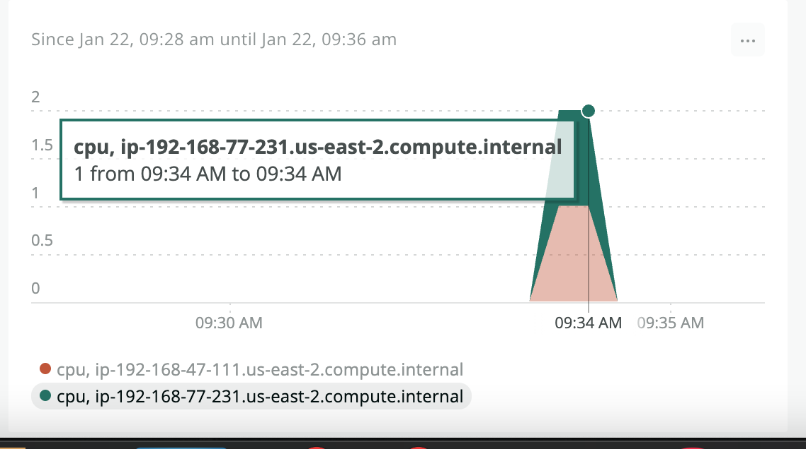

There are two general possibilities to integrate with New Relic:

* New Relic to steadybit: checking for specific events from New Relic in steadybit during experiment execution
* steadybit to New Relic: pushing steadybit events during experiment execution to New Relic

## New Relic to steadybit

We are able to react to the different events of New Relic and process them within the execution of an experiment. You can filter the events and determine at
which event type the experiment should fail.

#### Configuration

Under `Settings/Monitoring Integrations/New Relic` you can enable the State Check by providing the New Relic `Rest API Base URL` and the `REST API token` that
was previously created in New Relic. That's all we need to react on events of New Relic.

#### Usage

Once New Relic has been configured in the platform's settings, you will find a `New Relic State Check` in section `Execution and Monitoring` within the
configuration dialog of an experiment. The filtering of events is possible on New Relic Product, Entity Type and Event Type. We are supporting the following
types of events and products are supported.

##### Product

APM, Browser, Mobile, Servers, Plugins, Synthetics, Infrastructure, Alerts

##### Event Type

Application, Server, Key Transaction, Plugin, Mobile Application, Brwoser Application, Monitor, Host

##### Entity Type

Notfication, Deployment, Incident (open/close), Violation (open/close), Instrumentation

## steadybit to New Relic

By connecting steadybit to New Relic Insights you are able to investigate the effect of an attack within your familiar monitoring environment (e.g. New Relic
dashboards). Thus you can see the direct effect of an attack to certain metrics like erroneous calls, CPU usage or whatever metric is important to you.

### Configuration

Within steadybit go into `Settings/Monitoring Integrations/New Relic`, where you can enable the sending of events by providing the `Insights Base URL`, New Relic `Account Id` as well as
the `Insights Insert Key`. The former one can be looked up in the New Relic documentation, the latter two are created in the New Relic settings upfront.

### Usage

As soon as the configuration of New Relic Insights is provided, steadybit sends events of every executed experiment automatically to New Relic. These events can
be configured for instance as an own widget on your dashboard by using `NRQL` (New Relic Query Language). An example is given below as well as a
short explanation of the data structure.

#### Example Widget

Below you see an example widget that can be configured on your New Relic dashboard. This helps you to correlate the execution of an experiment with other dashboard widgets.



Events of steadybit are published as the custom event `ExperimentExecution` which can be queried using `NRQL`.
Therefore, go within New Relic to the Dashboard, add a new widget of type chart and use for instance the following `NRQL`:

```sql
SELECT count(targetName)
FROM ExperimentExecution
TIMESERIES FACET
    cases(  WHERE attack IN ('container-cpu-attack', 'host-cpu-attack') AS 'cpu',
            WHERE attack IN ('container-memory-attack', 'host-memory-attack') as 'memory',
            WHERE attack in('container-io-attack', 'host-io-attack') as 'IO'),
    container.host
```

#### Data Structure
Experiment Events coming from steadybit have generally the structure below. Thereby, `executionType` covers what was exectued (e.g. `attack` or `action` for a load test) and `status` whether it was `started` or `stopped`.

Attribute | Description | Values
---- | ----- | -----
`experimentKey` | Key of the experiment (consisting of teamname and number) | e.g. `BS-123`
`executionId` | Unique number of this specific execution instance | e.g. `1020`
`executionStep` | Indicates the executed step of the experiment or empty, if it is the start or end of the experiment | *EMPTY*, `action` or `attack`
`executionStatus` | Indicates the executed step of the experiment or empty, if it is the start or end of the experiment | *EMPTY*, `action` or `attack`

In addition, events covering the execution of an Attack (`executionTyp` = `attack`) have additional attributes:

Attribute | Description | Values
---- | ----- | -----
`attack` | Attack being performed | e.g. `container-cpu-attack`, `host-cpu-attack`, `container-stop-attack`
`targetType` | Type of the target | `host`, `container`, `application`
`targetName` | Name of the target | e.g. `k8s_fashion-bestseller_fashion-bestseller-bb896d756...`, `ip-10-2-3-122`
`k8s.container.name`)| Name of the container | e.g. `fashion-bestseller`
`container.host` | Name of the target | e.g. `ip-10-2-3-122`
... | All remaining attributes available also in the [discovery](discovery) and [design of experiments](1-design) | ...

### Useful Resources

- [EU and US Region data centers](https://docs.newrelic.com/docs/using-new-relic/welcome-new-relic/get-started/our-eu-us-region-data-centers)
- [API Keys](https://docs.newrelic.com/docs/apis/get-started/intro-apis/types-new-relic-api-keys)
