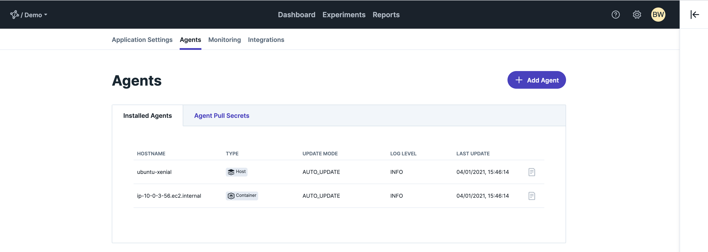

This guide helps you with the initial setup of our steadybit SaaS platform and leads you step by step through the first setup.

>If you are not using our SaaS and would like to know how to self-host our platform, please go to [Set Up On-Prem (self-hosted)](20-set-up-onprem).
>

You are only 4 steps away from your first experiment with steadybit:

- [Step 1 - Install Agents](#step1-installagents)
- [Step 2 - Set Up Areas](#step2-setupareas)
- [Step 3 - Invite Users and Create Teams](#step3-inviteusersandcreateteams)
- [Step 4 - Set Up Monitoring & Integrations](#step4-setupmonitoring&integrations)

In case something is not working out for you, [let us help you](https://www.steadybit.com/contact)!

## Step 1 - Install Agents
Our agents continuously gather and deliver target data to the platform, helping you to create targeted experiments based on always up-to-date data.
Therefore, it is necessary that you deploy the agents at the locations where you want to perform analyses and experiments.

> Without discovery data, no experiments are possible.

Please log in to our platform with your credentials and go to `/settings/agents/setup` or simply use our on boarding.
We offer our agents for different platforms and have made the installation as easy as possible for you.

Once the agents are rolled out, they connect to the platform and appear in the list of installed agents.

You can see in the overview of all agents where they are operated and which agent type they are.
Simple access to the log file of the agent is also possible.

If you want to know more details, check out the section [Installation Agent](../install-configure/30-install-agents)

## Step 2 - Set Up Areas

Our agents provide us with continuously updated information about your systems.
You as an `admin` can define areas and later assign them to teams, so that you and your colleagues can keep track.

If you want to know more details, check out the section [Set Up Areas](../install-configure/50-set-up-areas)

## Step 3 - Invite Users and Create Teams

You can group users to teams. Each team owns separate permissions for areas, allowing fine grained access control for your experiments.
Creating teams is possible only with the `admin` permission. Within teams there can be owners who manage the team and its members.

Thus, the teams can manage themselves and run experiments in the areas assigned to them.

If you want to know more details, check out the section [Teams and Users](../install-configure/60-teams-and-users)

## Step 4 - Set Up Monitoring & Integrations

We provide many integrations to monitoring systems.
Use these integrations to improve our analysis and to keep control during the execution of experiments.

To get you started, learn how to [configure your monitoring](../install-configure/70-configure-monitoring).

That's all, ready to start your first experiment! Check out one of these getting started:
- [How to run an experiment with a local Kubernetes cluster and a demo application](30-run-experiment-local)
- [How to run an experiment with a AWS EKS and a demo application](40-run-experiment-eks)
