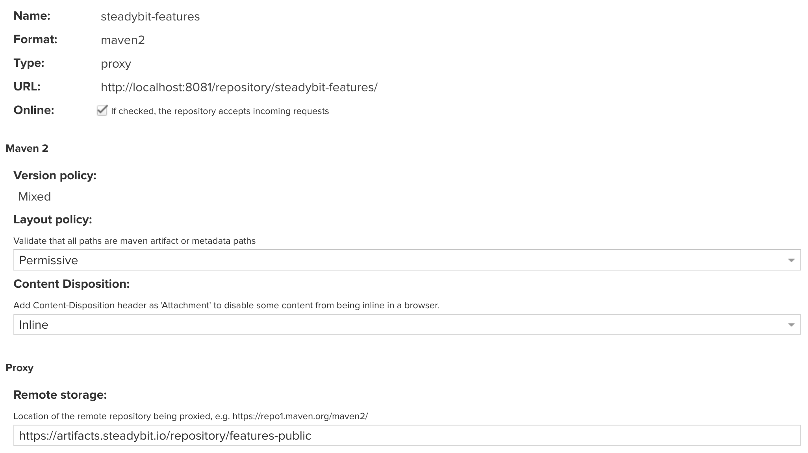

## Agent Configuration

| agent.sh Argument | Environment Variable                                | Description
|-------------------|-----------------------------------------------------|----------------------------------------------------------------------------------------------------------
| -a                | `STEADYBIT_AGENT_KEY`                               | The API key the agent uses <br/> **Example:** `foobar`
| -h                |                                                     | Override the hostname for the docker container to use. Useful on docker for mac
| -e                | `STEADYBIT_AGENT_REGISTER_URL`                      | The baseUrl where the agent registers. <br/> **Default:** `https://platform.steadybit.io`
| -i                | `STEADYBIT_AGENT_DOCKER_IMAGE`                      | The Agent Docker image to use. <br/> **Default:** `docker.steadybit.io/steadybit/agent:latest`
| -r                | `STEADYBIT_DOCKER_REGISTRY`                         | The Agent Docker registry to use. <br/> **Default:** `docker.steadybit.io`
| -u                | `STEADYBIT_DOCKER_REGISTRY_USER`                    | User for authenticating against the Docker Registry. <br/> **Default:** `_`
| -p                | `STEADYBIT_DOCKER_REGISTRY_PASSWORD`                | Password for authenticating against the Docker Registry. <br/> **Default:** STEADYBIT_AGENT_KEY
| -b                | `STEADYBIT_DOWNLOAD_USER`                           | The User to authenticate with the steadybit agent repositories <br/> **Default:** `_`
| -c                | `STEADYBIT_DOWNLOAD_PASSWORD`                       | The Password to authenticate with the steadybit agent repositories <br/> **Default:** STEADYBIT_AGENT_KEY
| -l                | `STEADYBIT_LOG_LEVEL`                               | Sets the loglevel for the com.steadybit logger <br/> **Default:** `INFO`
|                   | `STEADYBIT_ROOT_LOG_LEVEL`                          | Sets the loglevel for the root logger <br/> **Default:** `ERROR`
|                   | `STEADYBIT_LOG_CONSOLE`                             | Sets the loglevel threshold for the console logger <br/> **Default:** `ALL`
|                   | `STEADYBIT_LOG_FORMAT`                              | Sets the log format for the console logger (`json` or `text`) <br/> **Default:** `text`
|                   | `STEADYBIT_AGENT_REGISTER_TIMEOUT`                  | Timeout for the registration request. <br/> **Default:** `5s`
|                   | `STEADYBIT_AGENT_REGISTER_INTERVAL`                 | The interval how often the agent registers at the platform. <br/> **Default:** `5s`
|                   | `STEADYBIT_AGENT_EXPERIMENT_TIMEOUT`                | Timeout for the request to connect to an experiment. <br/> **Default:** `5s`
|                   | `STEADYBIT_AGENT_EXPERIMENT_KEEP_ALIVE_INTERVAL`    | Interval how often a keep alive is sent during an experiment. <br/> **Default:** `5s`
|                   | `STEADYBIT_AGENT_EXPERIMENT_KEEP_ALIVE_TIMEOUT`     | Timeout for a keep alive during an experiment <br/> **Default:** `5s`
|                   | `STEADYBIT_AGENT_EXPERIMENT_KEEP_ALIVE_MISSED_ACKS` | Max. Number of missed acknowledgements during an experiment. <br/> **Default:** `3`
|                   | `STEADYBIT_AGENT_DISCOVERY_INTERVAL`                | The interval of often the agent runs the discovery. <br/> **Default:** `30s`
|                   | `STEADYBIT_AGENT_DISCOVERY_TIMEOUT`                 | Timeout for the discovery. <br/> **Default:** `10s`
|                   | `STEADYBIT_AGENT_GZIP_ENABLED`                      | The interval of often the agent runs the discovery. <br/> **Default:** `true`
|                   | `STEADYBIT_DOCKER_SOCKET`                           | Docker Socket to connect to. <br/> **Default:** `/var/run/docker.sock`
|                   | `STEADYBIT_DISCOVERY_ENV_LIST`                      | List of environment variables to inlude in the discovery <br/> **Example:** `STEADYBIT_DISCOVERY_ENV_LIST=STAGE,REGION`
|                   | `STEADYBIT_LABEL_*`                                 | All env vars with this prefix will be added as label <br/> **Example:** `STEADYBIT_LABEL_STAGE=test`
|                   | `STEADYBIT_FEATURES_UPDATE_INTERVAL`                | Update Interval for Features <br/> **Default:** `PT6H` (6 Hours)
|                   | `STEADYBIT_AGENT_AWS_EC2_METADATA_URL`              | AWS EC2 Metadata URL <br/> **Default:** `http://169.254.169.254/latest/`
| -m                | `STEADYBIT_MVN_REPOSITORIES`                        | URLs of the steadybit agent repositories (Maven) <br/> **Default:** `https://artifacts.steadybit.io/repository/features-public@id=steadybit-features@snapshots@snapshotsUpdate=always,https://artifacts.steadybit.io/repository/releases-public@id=steadybit-releases@snapshots@snapshotsUpdate=always,https://repo1.maven.org/maven2@id=central` |
|                   | `STEADYBIT_HTTP_ENDPOINT_PORT`                      | HTTP endpoint port for the health check url <br/> **Default:** `42999`
|                   | `STEADYBIT_AGENT_ACTIONS_ENABLED`                   | Should this agent be eligible for executing actions? <br/> **Default:** `true`
|                   | `STEADYBIT_REPOSITORY_PROXY_HOST`                   | Hostname of a proxy to access steadybit repository <br/>
|                   | `STEADYBIT_REPOSITORY_PROXY_PORT`                   | Port of a proxy to access steadybit repository <br/>
|                   | `STEADYBIT_REPOSITORY_PROXY_PROTOCOL`               | Protocol of a proxy to access steadybit agent repository <br/> **Default:** `http`
|                   | `STEADYBIT_REPOSITORY_PROXY_USER`                   | Username of a proxy to access steadybit agent repository <br/>
|                   | `STEADYBIT_REPOSITORY_PROXY_PASSWORD`               | Password of a proxy to access steadybit agent repository <br/>
| -t static         |                                                     | Use the static version of the agent. When using Docker please use the static version of the image: `docker.steadybit.io/steadybit/agent-static` |

## Change Repository Location

### Agent Configuration

If you are using the dynamic agent with auto updates enabled, but your network setup does not allow any connection to an external repository,
you can simply change the repository location and use your own Maven repository as a mirror.
In this case you need to setup the following environment variables or provide the corresponding arguments to the agent.sh script (see above):

* STEADYBIT_DOWNLOAD_USER=<user>
* STEADYBIT_DOWNLOAD_PASSWORD=<password>
* STEADYBIT_MVN_REPOSITORIES=https://repo1.maven.org/maven2@id=central,https://<path-to-feature-repo>@id=steadybit-features@snapshots@snapshotsUpdate=always,https://<path-to-release-repo>@id=steadybit-releases

Please note: It is very important to follow the URL pattern given above so that the mapping of the repository ids can be done correctly.

### Proxy Configuration for custom Maven repository

Those three repositories needs to be mirrored by your own repository:

* Agent Features

Name: steadybit-features
Format: Maven2
Type: Proxy
Version Policy: Mixed
URL: https://artifacts.steadybit.io/repository/features-public
Username: _
Password: ${STEADYBIT_AGENT_KEY}

* Agent Releases

Name: steadybit-releases
Format: Maven2
Type: Proxy
Version Policy: Mixed
URL: https://artifacts.steadybit.io/repository/releases-public
Username: _
Password: ${STEADYBIT_AGENT_KEY}

* Maven Central

Format: Maven2
Type: Proxy
Version Policy: Mixed
URL: https://repo1.maven.org/maven2

### Example setup for custom Maven repository

For mirroring the steadybit repositories you can basically use every kind of repository, which supports Maven artifacts (e.g. Nexus, Artifactory, etc.).
In our example we show a basic setup with Nexus. For starting up a Nexus very quickly we use the ready to use Docker image from Nexus OSS in this example (only for demo purposes!):

```
docker run -d -p 8081:8081 --name nexus sonatype/nexus3
```

After login with the default credentials (User: admin, Password: ${docker exec -it nexus cat /nexus-data/admin.password}), we create the 2 proxy repositories from above first:

Example:


Overview:


After that you are ready to use this Nexus instance as a proxy with the following variable set:

```
export STEADYBIT_MVN_REPOSITORIES="https://repo1.maven.org/maven2@id=central,http://localhost:8081/repository/steadybit-features@snapshots@snapshotsUpdate=always,http://localhost:8081/repository/steadybit-releases@id=steadybit-releases@snapshots@snapshotsUpdate=always"
```
