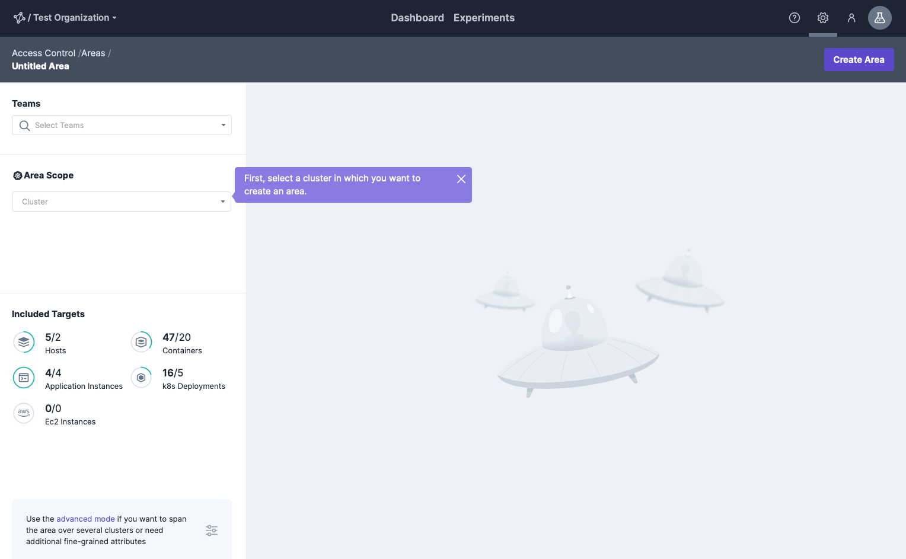

No one knows your system better than you, so it is obvious that you should be the one who structures the discovered targets.

It's up to you whether you use areas to separate parts of your system from each other (like "bounded contexts" in domain driven design), to separate your environments (like development, QA and Production) or simply both.

## Default Area: Global
Per default, your system contains one area called `Global`.
This is the place where __every__ target that steadybit has discovered will be in.
So, using Global for the start is fine (when trying out steadybit), but on the long run dangerous and you should create your own.

## Define your own Area
To create or change an area go to `/settings/access control/areas` and choose to either add an area or edit an existing one.
An area consists of a
- **Name**: A meaningful name helps to find the area afterwards (e.g. "Onlineshop DEV" or "Contract Management PROD").
- **Included Targets**: The targets belonging to an area are specified by using our [discovery data](../learn/30-discovery). This is the upper limit of targets that can be attacked when running an experiment in a certain area.
- **Team**: For using that area to run an experiment you need to assign the team to it.
  This can be done from Area-perspective (`/settings/access control/areas` ) as well as from Team-perspective (`/settings/access control/teams`).
  It limits access to the users of a team to certain areas (so systems and environments).

Areas can be defined using two different modes
- **Kubernetes** (*default*): Allow you to define the area pretty easy and fast by using the landscape and choosing the cluster, namespace and deployments you want to have.
- **Advanced**: In case you need more fine-grained control (e.g. different availability zones, specific hosts or non-kubernetes applications)

### Kubernetes Areas
When creating a new area you end up by default in Kubernetes-based mode. In case you have no Kubernetes you need to switch to the Advanced Mode (see below).

First thing is to select your Kubernetes cluster.
After that you can add Kubernetes namespaces and deployments to your area.

Don't forget to finally assign the area to a team and give it a meaningful name.
That's it, you are ready to use that area in an experiment!

### Advanced Areas
An advanced area is needed in case
- you are not using Kubernetes
- you need more fine-grained control (e.g. limit area to a specific AWS Availability Zone).

Therefore, you can switch to the advanced mode and use the Query Builder to define the area.
On the right hand side you can see all included targets for that area.

Don't forget to finally assign the area to a team and give it a meaningful name.
That's it, you are ready to use that area in an experiment!

## Use Areas
Once the areas are defined and assigned to teams, you can make use of them when e.g. [designing an experiment](../use/10-experiments/10-design).

