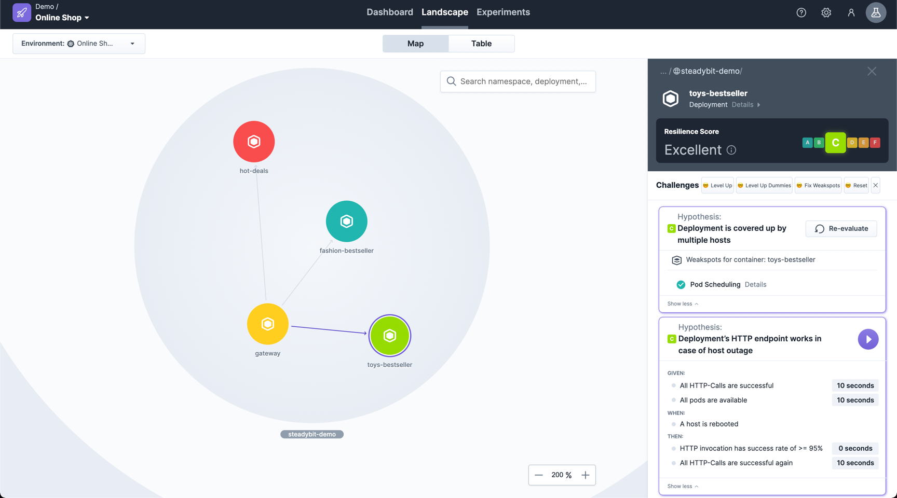
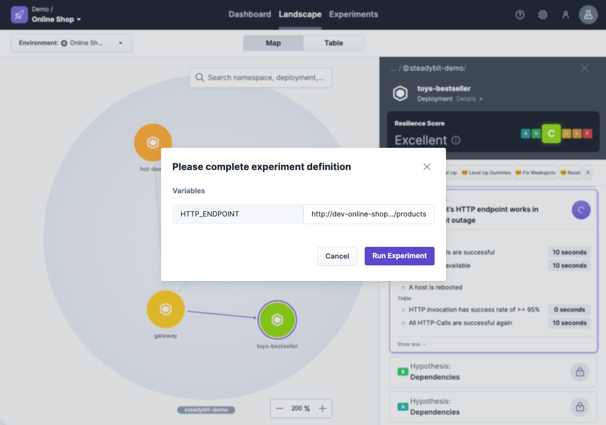

Within your system's landscape steadybit suggests you challenges to take in order to reach a resilient system. These challenges are on one hand experiments you
can run to check your resilience and on the other hand configuration issues (weak spots) you should fix. All challenges can be easily taken with a single-click
and don't need much experience in Chaos Engineering.

> Resilience Score is currently limited to Kubernetes Cluster and Kubernetes Deployments.
> Dependency-related experiments are only suggested after you use your system and only support TCP-based connections to other Kubernetes Deployments.
> Future Extension is part of our roadmap.

## Score

When clicking on a single Kubernetes Deployment you can see its current Resilience Score. This score can be easily improved by completing suggested experiments
and fixing discovered configuration issues (weak spots).

So, it is natural that the score starts with a bad evaluation (i.e. "F") and automatically improves while you are taking actions.

## Suggested Challenges

The suggestions are ordered as a rising challenge. This way, it is relatively safe to tackle the first challenges without worry. However, keep in mind that the
deployments have different criticality and not every deployment needs to reach the highest score.

The suggested challenges consist of

- **Experiments** which needs to be executed manually by the user to check whether the system is able to survive the configured turbulent condition. If not, you
  should analyse and fix the discovered issue and validate your changes by running the experiments again.
- **Weak Spots** highlight configuration issues of your applications. They are discovered automatically without the need to execute an experiment. They are
  usually useful pre-conditions before running one of the experiments suggested subsequently.

The following experiments and weak spots are suggested based on your score:

### Challenges for Recovery

##### Experiment: Deployment recovers when single container gets killed
When a single container is killed, your deployment/POD should be marked as unhealthy. We check whether the container is recovering within 2
minutes automatically and your POD is going back to ready again.

#### Experiment: Deployment also recovers in case of a host outage
Increasing the pace, we check whether your system is capable to recover from a host outage within 10 minutes.

### Challenges for Redundancy

#### Weak Spot: Deployments is properly configured for redundancy
Single point of failures are usually bad in a resilient system. That's why we recommend to configure Kubernetes `Readiness Probe` so that
Kubernetes can identify whether the POD is ready to receive traffic and a `POD Replica Count` >1 so that you have redundancy in your system.

#### Experiment: Deployment’s HTTP endpoint* is covered by redundancy
Having the configuration issue of the weak spot resolved is only half of the story. Let's check whether the redundancy works with a success rate >=95%.
To do that we need a load-balanced HTTP endpoint of the deployment which we can check while killing one of the container.
See below for more input on the required input.

### Challenges for Redundancy during Updates

#### Weak Spot: Updating the deployment leads to no downtime
We recommend that you deploy your applications without downtime.
Therefore, the deployment strategy `RollingUpdate` in your Kubernetes manifest can be used.

#### Experiment: Deployment works while performing an update*
Verify that your system works during the update without a peek in error rates.
Therefore, we simulate the deployment by continous restarting each POD and check in parallel your HTTP endpoint's success rate.

### Challenges for Host Redundancy

#### Weak Spot: Deployment is covered up by multiple hosts
Redundancy between deployments is only half of the story.
The other one is to spread the redundant PODs of a deployment across multiple hosts.
Thus, we verify the amount of hosts that are used to run all PODs and recommend using an `Affinity`/`Anti-Affinity`-configuration.

#### Experiment: Deployment’s HTTP endpoint works in case of host outage*
Let's verify your host redundancy with an experiment by rebooting one host and checking the success rate of the HTTP endpoint.

### Challenges for Loose Coupling on Startup

#### Experiment: Deployment starts up even when dependency ... is unavailable
An important principle of a distributed system is loose coupling - especially while starting a deployment.
Verify your coupling during startup by use the pre-generated experiments (one per discovered dependency) and check whether your POD's container is able to get ready even while the dependency is not available.

### Challenges for Loose Coupling

#### Experiment: Deployment’s HTTP endpoint* works independent of dependency ...
Loose coupling is not only needed during the start-up of a deployment but also, in the best case, during its entire operation.
Takle this biggest challenge of your resilient system by executing these automatically generated experiments (one per discovered dependency).
We check your system's functionality via the load balanced HTTP endpoint and simultaneously block a dependency of your deployment.

### Required Input Parameter: HTTP Endpoint
The majority of the experiments can be executed without any user input. So, a single click to verify the hypothesis.

However, for some experiments (marked with a *) we want to check whether the configured redundancy works from user perspective. For now, we can only validate this by asking for a
load-balanced HTTP endpoint which is offered by the Kubernetes deployment. We will perform periodically a `HTTP GET` and assume to receive a HTTP response
code `200 - OK`.

> ## Call for Feedback
> Landscape and Resilience Score are two relatively new features which we would like to get your opinion on.
> Feel free to [reach out to us](https://www.steadybit.com/contact) and share your experience.
