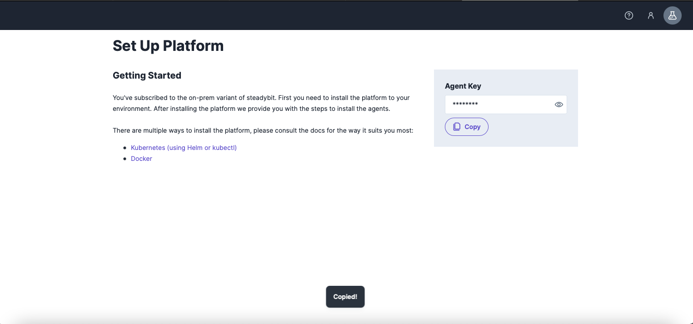

# Install On-Prem Platform

This guide helps you with the initial installation and deployment of our steadybit platform On-Premise. It is explicitly of use for spaces where it is not yet possible to take advantage of our Software as a Service (SaaS) platform and the need to host our platform yourself. After completing this getting started, continue by [setting up steadybit](../../install-configure/10-set-up-platform-agents/)

> If you are interested in using our SaaS platform, [let us know](https://www.steadybit.com/request-demo) and continue directly with the getting started of how to [set up the platform](../../install-configure/10-set-up-platform-agents/).

Installing and deploying the steadybit platform on your servers is simple:

* [Step 0 - Check Prerequisites](./#step-0---check-prerequisites)
* [Step 1 - Get your key](./#step-1---get-your-keys)
* [Step 2 - Deploy Platform](./#step-2---deploy-platform)

If you need help, please [reach out to us](https://www.steadybit.com/contact).

### Step 0 - Check Prerequisites

You should have already received an invitation mail for the [steadybit platform](https://platform.steadybit.io/) where you can login with your e-mail address and a temporary password. This temporary password needs to be changed immediately at first login. After that, you see the following page which we need later on.


Before continuing, make sure that access to the following URLs via HTTPS (443) is possible from your location of installation:

* https://docker.steadybit.io and https://index.docker.io (Docker Image)
* https://artifacts.steadybit.io (Agent Linux Installation)
* https://get.steadybit.io (Setup Scripts)
* https://steadybit.github.io/helm-charts (when using Kubernetes and helm)

The platform itself exposes the following ports:

* Port 8080: Application port for UI/API
* Port 7878: Acceptor port for agents

### Step 1 - Get your keys

After logging in into the [steadybit platform](https://platform.steadybit.io/) you get access to the **Agent Key**. The Agent Key is needed to install the platform and connect the steadybit agents against it.



So, simply copy the agent key from here and use it in the next step to deploy the platform.

### Step 2 - Deploy Platform

Our platform is installed as Docker container. The platform container image is available in the steadybit Docker Registry. The machine you are installing steadybit onto, must have 4 CPUs and 8 GB available memory.

Please choose one of the following deployment options:

* [Step 2.1 - Kubernetes](./#step2.1-kubernetes)
* [Step 2.2 - Docker](./#step2.1-docker)

### Step 2.1 - Kubernetes

It is our goal to make the installation as easy as possible for you, that's why we recommend you to use our Helm chart that takes a lot of the work out of it and only requires a few parameters from you. If you are not familiar with Helm and would like to learn more about it, check out [helm's QuickStart](https://helm.sh/docs/intro/quickstart/)

Please replace the placeholder `replace-with-agent-key` with your agent key copied in [Step 1 - Get your key](./#step-1---getyourkey) and start the helm chart installation with:

```bash
helm repo add steadybit https://steadybit.github.io/helm-charts
helm repo update
helm install steadybit-platform \
  --create-namespace \
  --namespace steadybit-platform \
  --set agent.key=<replace-with-agent-key> \
  steadybit/steadybit-platform
```

To make it convenient for you, we have a default for everything. That's also why we include the necessary Postgres database and set up everything for you automatically. Nevertheless, feel free to adjust parameters after having a look on the helm chart in our public [GitHub repository](https://github.com/steadybit/helm-charts/tree/master/charts/steadybit-platform).

> **BE AWARE:** The database is not backed up and if the pod is deleted the data is lost!
>
> For productive usage, we strongly recommend to setup your own Postgres database and configure the steadybit platform as described [here](../../40-install-platform/30-advanced-configuration/).

In case you prefer to deploy our steadybit platform using Kubernetes directly instead of the helm chart, you can find everything you need [here](../../40-install-platform/20-k8s/#deploytheplatformusingkubectl).

See also [Kubernetes](../../install-configure/40-install-platform/20-k8s/) for further informations about the setup with Kubernetes.

### Step 2.2 - Docker

At least a Docker installation and a PostgresSQL database is required to run the platform. Please replace the placeholder `agent-key` with your value copied in [Step 1 - Get your key](./#step-1---getyourkey). Furthermore, replace the placeholders `jdbc-url`, `jdbc-user` and `jdbc-password` in our one liner script with the settings of your running PostgreSQL database.

```bash
curl -sfL https://get.steadybit.io/platform.sh | sh -s -- -a <agent-key> -d <jdbc-url> -e <jdbc-user> -f <jdbc-password>
```

See also [Docker](../../install-configure/40-install-platform/10-docker/) for further informations about the setup with Docker.

### What's next?

Done, the platform is running. The default login for the on-prem platform is

* username: admin
* password: admin

Now you can set it up by connecting the first agents to it.

We'll show you how to do that in our getting started [Set up Platform & Agents](../../install-configure/10-set-up-platform-agents/#step-1---install-agents), at step 1.

#### Productive Usage

As mentioned above, this getting started helped to set up quickly a steadybit platform.

Before using steadybit

* configure your own Postgres database as [described here](../../40-install-platform/30-advanced-configuration/).
* we recommend to use your internal authorization services such as LDAP or OIDC provider as [described here](../../40-install-platform/10-docker/#externalldap).

#### Advanced Configuration

More configuration options can be found in [Advanced Configuration](../../install-configure/40-install-platform/30-advanced-configuration/)
