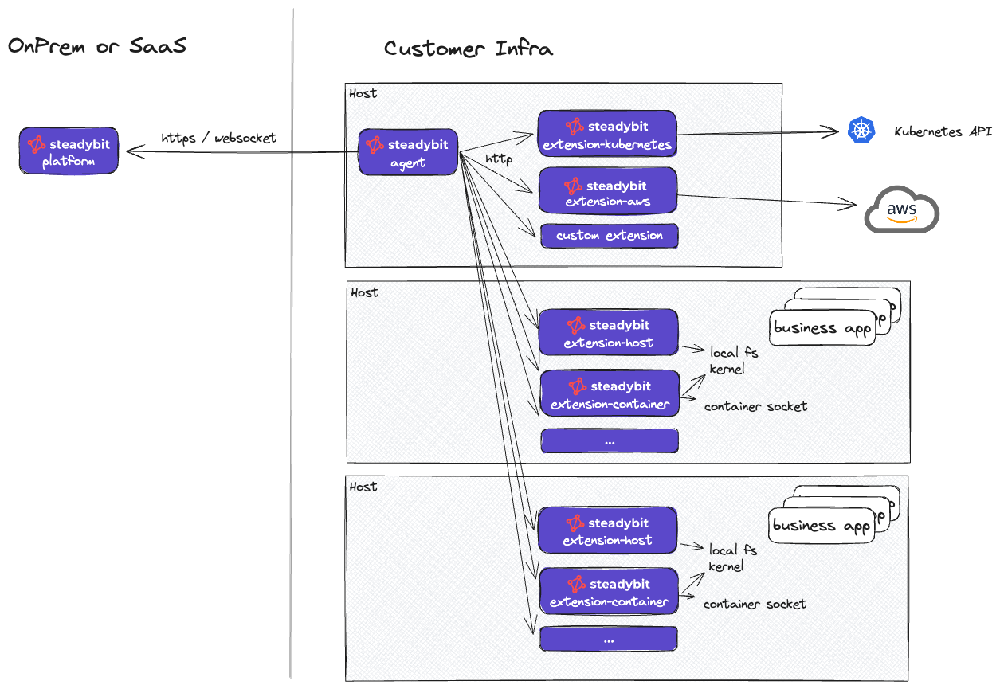

# Agent Architecture

The core of the Steadybit architecture is the agent-based approach consisting of

* a central platform, being the center of control for you
* one agent per network boundary, deployed somewhere in your system and works as a channel between the platform and multiple extensions
* extensions, deployed wherever you need them,  to discover running infrastructure components (hosts, containers, Kubernetes resources, etc.) and run actions (like, e.g., chaos engineering attacks or checks).

The following diagram shows this in an example of three hosts, one with the agent installed to communicate with the installed extensions and platform.
* The agent is deployed only once, as everything runs within one network.
* Also, the AWS and Kubernetes extensions only run once as they work with the respective API.
* The extensions for host- and container-based chaos engineering need to run per host to reach the underlying resources (e.g., network, CPU, memory)

The Steadybit agent periodically polls its registered extensions for discovery data using HTTP. For each call, only the delta of the discovery data is sent to the platform.\
If an experiment is to be executed for the agent, the agent connects via a websocket to the platform and receives the actions to be executed. The agent will then control the action execution and calls the respective HTTP endpoints of the extension. If the connection between the platform and agent or agent and extension is interrupted, the agent immediately stops and rollbacks any active action.


The Steadybit platform never connects to the agent or any extensions: \
_all connections are initiated by the agent_, regardless of the deployment model.


Check our [reliability hub](https://hub.steadybit.com/extensions) for an up-to-date list of extensions. Our extensions are Open Source and available on [github.com](https://github.com/steadybit). They are written in Go to ensure the best possible resource usage.
