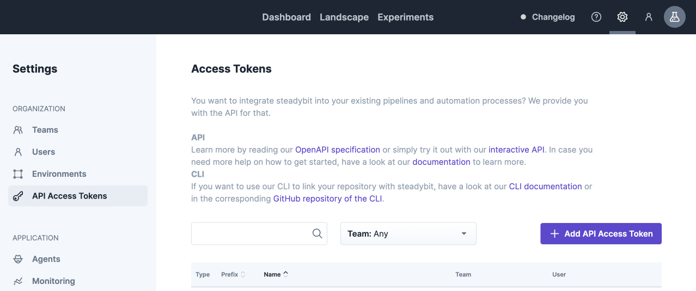
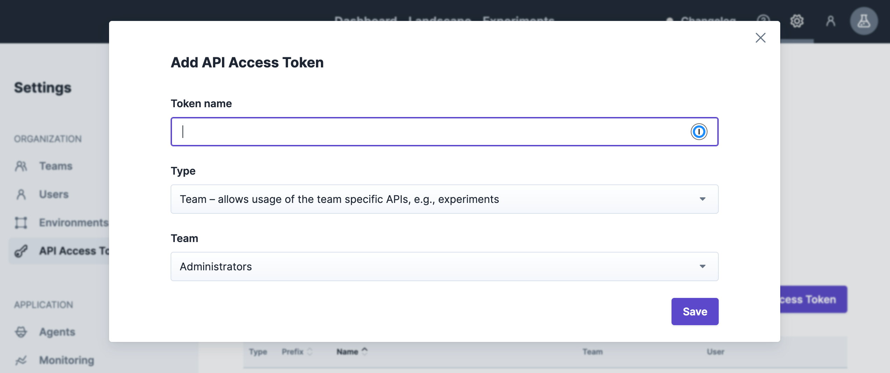

# API

The steadybit Web API allows interfacing with the platform. We follow the principle that every feature available at UI also is available via API.

In order to access the API, you need to have Access Token.

## Access Tokens

In order to use the API you need to create an API access token. API access tokens are managed by the admin and team owners.

API token management can be found in Settings → API Access Tokens.



We differentiate between team tokens and admin tokens.

**Team Tokens** are bound to a team and can be used to access all experiments of a team.

**Admin Tokens** have access to management APIs to manage e.g. teams or environments. Admin tokens are only available to the admin user.

### Create a new token
You can create a new token via the platform's user interface. Go to Settings → API Access Tokens.




Once you created a new API access token, you can't see it again. Make sure to save it at a safe place!



#### Create an Admin Token via internal API
On-Prem customers have also the possibility to create an Admin Token via internal APIs.

##### Create Admin Token via CLI
To generate a new admin token in your On-Prem Platform via CLI, first ssh into the platform server.
Afterward, run the following command: 

```bash
/scripts/createAdminToken.sh

Missing mandatory arguments
Usage: /scripts/createAdminToken.sh -n <name> -t <tenantKey>
  -n | --name <name>           Name of the token
  -t | --tenantKey <tenantKey> Tenant key
  -h | --help                  Show this help
  
  
/scripts/createAdminToken.sh -t demo -n AdminToken
Z8pChlF2*************
```

The token will be printed to the console.

##### [On-Prem] Create Admin Token via HTTP API
To generate a new admin token in your On-Prem Platform via HTTP API, first ssh into the platform server.
Afterward, you can run curl:

```bash
curl --header "Content-Type: application/json" \
  --request POST \
  --data '{"name":"'$NAME'","tenantKey":"'$TENANTKEY'"}' \
  http://localhost:9090/actuator/adminaccesstoken
```

> This end point is only accessible for On-Prem customers and only from localhost. It can not be accessed from outside your server.

## OpenApi Specification

We provide a [OpenApi 3.0 Specification for the API](https://platform.steadybit.com/api/spec) as well as an [interactive documentation](https://platform.steadybit.com/api/swagger).
In case you are using our on-prem variant you can access it at `http://<your-installation-url>/api/spec`.

### Example: Create Experiment

This is how you can create an experiment (json is supported as well):

```bash
curl \
  -i \
  -H 'Content-Type: application/x-yaml' \
  -H 'Authorization: accessToken XXXXXXXX.XXXXXXXXXXXXXXXXXXXXXXXXXXXXXXXX' \
  https://platform.steadybit.com/api/experiments \
  --data '
---
name: Experiment API Test
team: ADM
environment: Global
lanes:
  - steps:
      - !<action>
        actionType: check:http
        parameters:
          method: "GET"
          url: "https://example.com"
          headers: []
          successRate: 100
          maxConcurrent: 5
          requestsPerSecond: 1
          duration: "10s"
          followRedirects: false
          readTimeout: "5s"
          connectTimeout: "5s"
          statusCode: "200-299"
'
```

The `Location` header of the response indicates the url of the newly created experiment:

```
location: https://platform.steadybit.com/api/experiments/ADM-
```

### Example: Run Experiment

You can then run the experiment:

```bash
curl \
  -i \
  -X POST \
  -H 'Authorization: accessToken XXXXXXXX.XXXXXXXXXXXXXXXXXXXXXXXXXXXXXXXX' \
  https://platform.steadybit.com/api/experiments/ADM-1/execute
```
