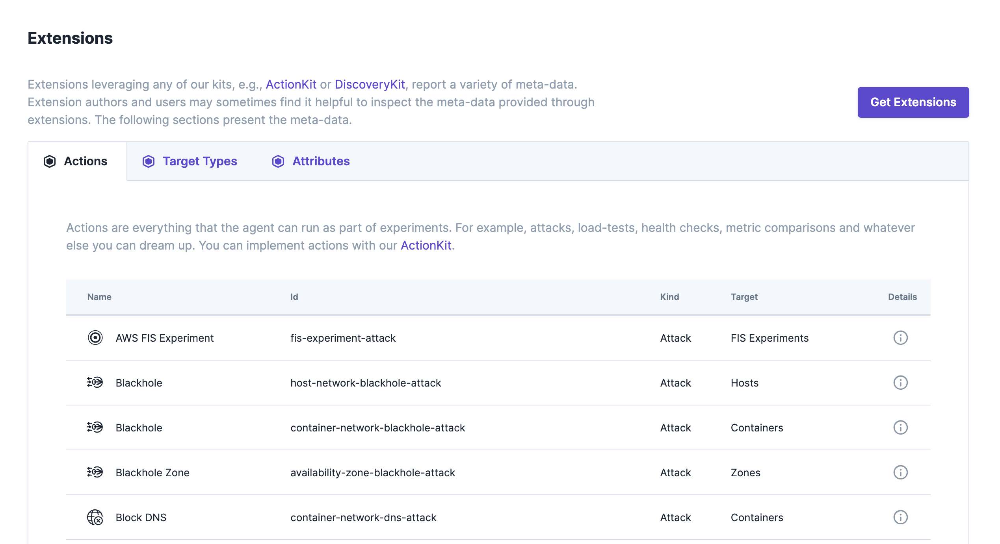

# Extension Installation

Extensions follow common installation patterns that look something like this:

1. Deploy the extension within your infrastructure.
2. Extend the agent configuration so that the agent can communicate with the extension.
   * This step can be skipped for extensions installed via our Helm charts as these set [extension auto-discovery annotations](https://github.com/steadybit/helm-charts/blob/2c7c40e193fdbe386b10ff08e2547d27d7ac749a/charts/steadybit-extension-datadog/templates/service.yaml#L10-L19).
   * For extensions deployed outside of Kubernetes or with missing auto-discovery, see the respective documentation of the extension or the extension kits' respective documentation.
     * [ActionKit](https://github.com/steadybit/action-kit/blob/main/docs/action-registration.md)
     * [DiscoveryKit](https://github.com/steadybit/discovery-kit/blob/main/docs/discovery-registration.md)
     * [EventKit](https://github.com/steadybit/event-kit/blob/main/docs/event-registration.md)

Most extensions will require extension-specific configuration. For example, the Kong extension needs to know how to reach\&authenticate with Kong API gateways, while the AWS extensions require the configuration of IAM roles. As a result, no single set of instructions covers all extensions. However, extensions' documentation should describe the exact configuration and installation steps.

## Manage your Extensions

In the platform, you can manage your extensions via the extensions tab. You can see the extensions that are currently installed. Go to [Settings -> Extensions](https://platform.steadybit.io/settings/extensions) to see the list of installed extensions.

