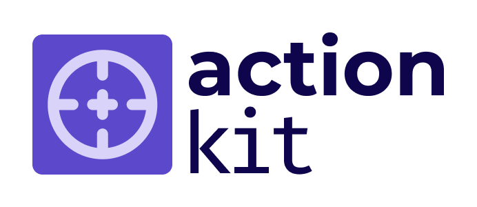

# Extension Kits

Three extension kits exist through which Steadybit's capabilities can be extended. Unless you are thinking about authoring a custom extension, you probably do not need to know about these kits.

## ActionKit

The Steadybit ActionKit enables the extension of Steadybit with new action capabilities that you can use within experiments. For example, ActionKit can be used to author open/closed source:

* attacks to attack AWS, Azure, and Google Cloud services that Steadybit cannot natively attack,
* integrate load testing tools,
* health and state checks and
* every other runnable action!

You can learn more about ActionKit through its [GitHub repository](https://github.com/steadybit/action-kit).

## DiscoveryKit

The Steadybit DiscoveryKit enables the extension of Steadybit with new discovery capabilities. For example, DiscoveryKit can be used to author open/closed source discoveries for:

* proprietary technology,
* non-natively supported open-source tech,
* hardware components and
* every other _"thing"_ you would want to see and attack with Steadybit.

You can learn more about DiscoveryKit through its [GitHub repository](https://github.com/steadybit/discovery-kit).

## ExtensionKit

Through kits like ActionKit and DiscoveryKit, Steadybit can be extended with new capabilities. ExtensionKit on the other hand contains helpful utilities and best practices for extension authors leveraging the Go programming language.

You can learn more about ExtensionKit through its [GitHub repository](https://github.com/steadybit/extension-kit).
