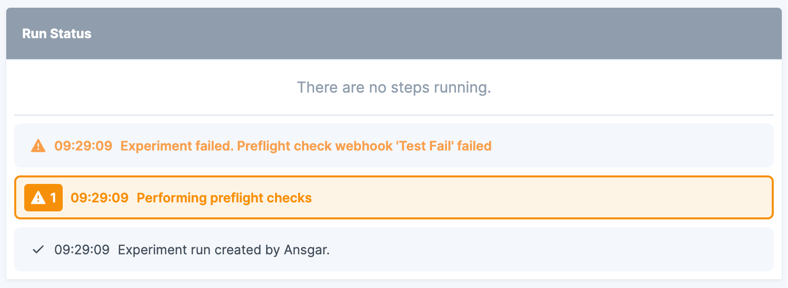

# Preflight Webhooks


Preflight webhooks are an enterprise feature. Please [reach out to us](https://steadybit.com/contact) if you want to get access.


Preflight webhooks are triggered by Steadybit whenever an experiment is about to start and allow you to prevent an experiment from running.
To decide whether that specific experiment run is allowed to start, you get a list of all expected affected targets in the webhook call.
Please note that, due to concurrency, these affected targets may change in case one of the targets is gone when the actual step starts or new ones are
discovered.

## Configure Preflight Webhooks

You can add preflight webhooks at `Settings / Application Settings / Integrations / Preflight webhook`.


A webhook has the following parameters to be specified:

|            |                                                                                                                                                 |
|------------|-------------------------------------------------------------------------------------------------------------------------------------------------|
| **Name**   | The preflight webhook's name, it is shown in the experiment run.                                                                                |
| **URL**    | The URL, which will receive an HTTP Post request with the HTTP request body                                                                     |
| **Secret** | <strong>optional</strong>You may specify a secret which is used to sign the body to [verify the webhook request](#verify-webhook-requests)</a>. |
| **Team**   | If no team is specified, preflight checks will be performed for all teams. If you specify a team, preflight checks are only made for this team. |
| **Events** | Right now, there is only one event here: `Execution preflight checks` which is triggered before starting an experiment run.                     |

## Experiment Runs with configured Preflight Webhooks

During the experiment run, you can see the triggered preflight webhooks.
If a webhook fails, the experiment run fails, and no targets are attacked.




## Developing Webhooks

A webhook uses an HTTP POST request at an endpoint reachable from the Steadybit platform.
The HTTP request sends a body with the content-type `application/json`.
Our [OpenAPI specification](https://platform.steadybit.com/api/spec) describes the exact body in `WebhookPayload`.

To allow an experiment to run, the webhook must return an HTTP status 2xx.
The experiment will not run if the webhook returns an HTTP status code other than 2xx.

Optionally, you can return a `message` in the HTTP response to show why the experiment isn't allowed to start.
The response body can be found in the [OpenAPI specification](https://platform.steadybit.com/api/spec) as `PreflightWebhookResponseAO`.

### Lifecycle of Preflight Webhooks

A preflight webhook can be in one of the following lifecycle status:

|                |                                                                                                                                                                           |
|----------------|---------------------------------------------------------------------------------------------------------------------------------------------------------------------------|
| **CREATED**    | The preflight webhook was created and has sent the request to the configured webhook. It is still waiting for the response.                                               |
| **SUCCESSFUL** | The preflight webhook was resolved successfully with an HTTP status code 2xx. The experiment is allowed to continue (if all preflight webhooks are successful).           |
| **FAILED**     | The preflight webhook resolved with a non-2xx HTTP status code. The experiment will fail. Optionally, the response may contain a message as an experiment failure reason. |
| **ERRORED**    | Technical error happened while requesting the HTTP endpoint, e.g. the URL couldn't be resolved, or the HTTP request timed out.                                            |


A webhook will timeout after 55 seconds. In that case, the preflight check is marked as `ERRORED`, and the experiment will not start.
If the webhook resolves later on, the actual result will be submitted to the preflight check step in the experiment.


### Verify Webhook Requests

You can verify that the call to the preflight webhook is legitimate by verifying the signature. as soon as the webhook's optional secret is configured.
To do that, you need to configure the optional webhook's secret.
The signature of the body is computed using `HMAC SHA-256` and sent as `X-SB-Signature` HTTP header.

You can use this header to verify the message. Here is an example of doing this in Java:

```java
private static boolean validateSignature(byte[]body,String secret,String header)throws Exception{
        //calculate the signature using the secret
        Mac mac=Mac.getInstance("HmacSHA256");
        mac.init(new SecretKeySpec(secret.getBytes(StandardCharsets.UTF_8),"HmacSHA256"));
        byte[]signature=mac.doFinal(body);

        //remove the algorithm prefix and decode the hex to bytes[]
        byte[]receivedSignature=Hex.decode(header.replaceFirst("^hmac-sha256 ",""));

        //compare using time-constant algorithm
        return MessageDigest.isEqual(signature,receivedSignature);
        }
```

