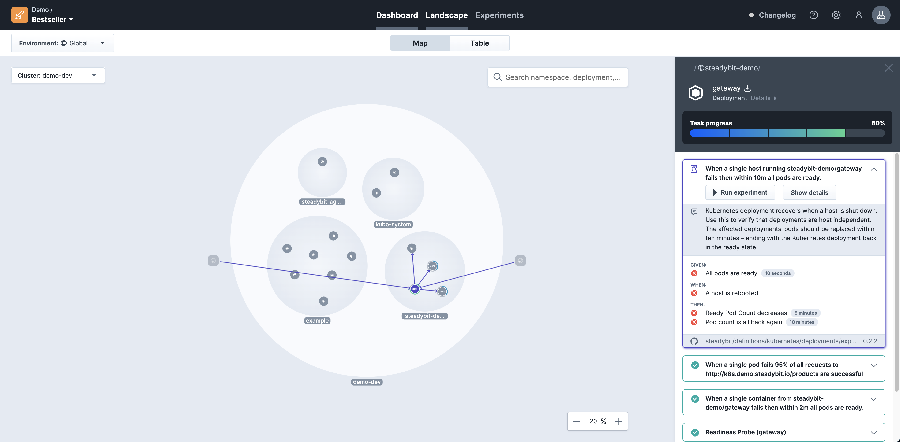

# Define Resilience Expectations

Resilience expectations are a cornerstone of Steadybit's capabilities, and in this guide, you will learn what they are and how to use them.

You can think about resilience expectations like linting or security rules (ESLint, SonarQube, dependency auditing and more) for your systems' resilience. Resilience expectations help you identify issues and (non-) compliance with the desired state. For example, Steadybit can outline that a particular Kubernetes configuration best practice isn't followed or that an HTTP request is missing timeouts or retries. Resilience expectations are declarative by nature. This means that resilience expectations are easy to get started with. No need for a resilience or chaos engineering expert!

You can get started with resilience expectations via our CLI or the UI. This guide will help you get started with our CLI, which has greater flexibility and ensures that you can apply configuration as code best practices.

### Prerequisite

* You have already signed up for an account [on our website](https://www.steadybit.com/get-started/)
* You are able to login into the [Steadybit SaaS platform](https://platform.steadybit.io/)
* You have already [installed the agents](../content/getting-started/10-set-up-platform-agents/)

### Step 1 - CLI Installation

The CLI requires at least Node.js version 14 to execute. We recommend installing Node.js via [Node Version Manager](https://github.com/nvm-sh/nvm#intro). Once Node.js is installed, you can use NPM to install our [CLI package](https://www.npmjs.com/package/steadybit).

npm install -g steadybit

### Step 2 - Authentication

Once the CLI is installed, you will find that a new global executable named `steadybit` is available. Before you can start defining expectations, you need to authenticate with your Steadybit account via an [API access token](../integrate/10-api/#tokens). Authentication profiles are the most comfortable way to do so:

steadybit config profile add

### Step 3 - Defining a Resilience Expectation

Resilience expectations are formulated through so-called service definitions. When using the CLI, you will be interacting with service definition YAML files (`.steadybit.yml`). To create such a file, you can use the following command:

steadybit service init

### Step 4 - Uploading the Resilience Expectation

You can use the following command to upload the service definition file to your Steadybit platform. Don't worry; this won't execute any attacks or experiments.

steadybit service apply

### Step 5 - Checking Resilience Expectation State

Now that the Steadybit platform knows about your service definition and expectations, it is time to check how many of the selected tasks are fulfilled!

steadybit service verify

### Step 6 - Inspect State in the UI and Execute Experiments

Depend on your selection in step 3, you may find that not all tasks are fulfilled! To learn more about each tasks' state you can open the Steadybit UI to learn more and to execute experiments!

steadybit service open

### Conclusions

This guide has shown how to use the CLI to declare a service's desired resilience. Approaching resilience in a declarative way makes it easier to get started. On top of this, we leveraged a configuration as code approach which helps us evolve, version and update our expectations together with the described service. There was no need to know Kubernetes best practices or chaos engineering specifics. Resilience expectations enable everyone to rely on reusable (pre-defined) policies and tasks to observe and improve service resilience!

### Next Steps

* [Learn about policies and tasks referenced through service definition files.](../learn/60-resilience-expectations/10-introduction/)
* [Run your own experiments with the Steadybit UI](../getting-started/30-run-experiment/)
