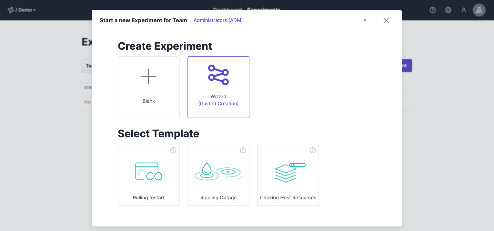
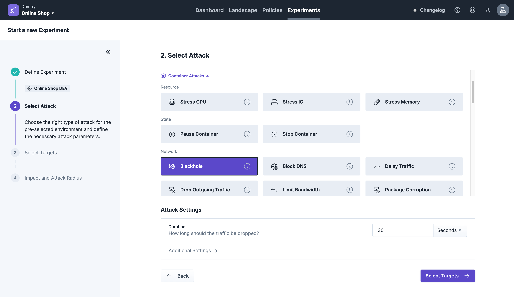
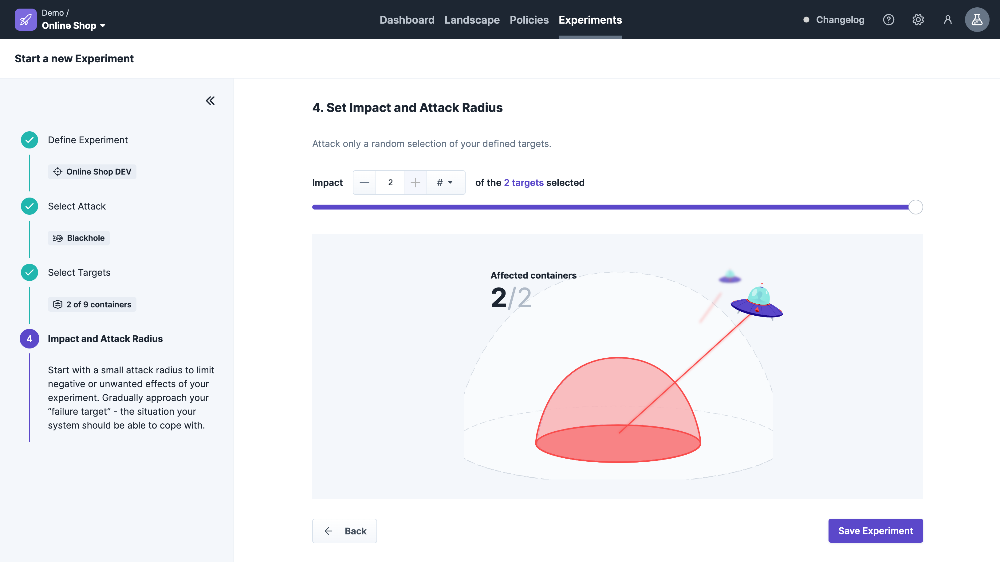
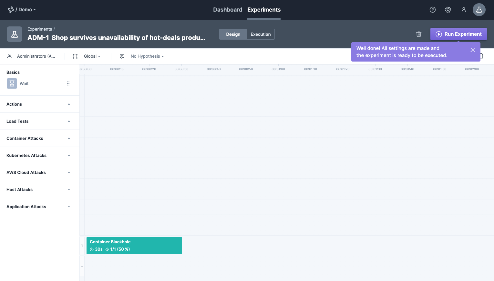
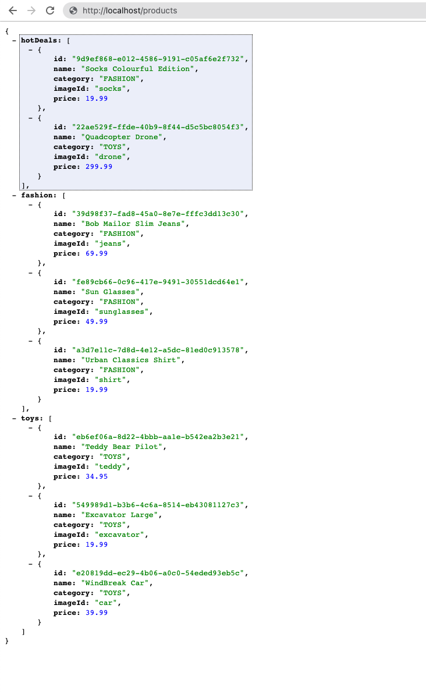

# Run an Experiment

We will now use steadybit to design and run our first experiment. We focus in this guide on our example application of shopping demo, which you have [optionally deployed following these steps here](../content/getting-started/15-deploy-example-application/). However, you can also apply the steps to your own application.

### Prerequisite

* You have already signed up for an account [on our website](https://www.steadybit.com/get-started/)
* You are able to login into the [Steadybit SaaS platform](https://platform.steadybit.io/)
* You have already [installed the agents](../content/getting-started/10-set-up-platform-agents/)

### Step 1 - Define your Hypothesis

We want to find out how our shopping demo behaves when one of the backend service can not be reached. Therefore, we simulate the unavailability of one container (`hot-deals`) by isolating it on network level. This approach is less invasive than stopping it.

To do that, we start by creating a new experiment via our Wizard, which guides us through every step:



### Step 2 - Define Experiment

First step is to give our experiment a meaningful name and define the environment where to be executed. To keep things simple, we choose the `Global` environment to get access to everything steadybit has discovered and not being limited in scope/permissions yet.


### Step 3 - Select Targets

In the next step we can define our target. Since our target of our experiment is a container running in Kubernetes, we select Container as target kind. Furthermore, we want our experiment to be reusable even after container restarts, so we describe our target container with attributes and not by a unique name.



### Step 4 - Set Impact and Attack Radius

Going to the next step, we can define how large our impact is. When having a scaled system you may want to start with a small attack radius first - affecting only one container and not all replicas.

Since in the current deployment none of the services are scaled, we keep the default of only one affected container.


### Step 5 - Select Attack

Last but not least: We choose the attack. We want to simulate unavailability of the `hot-deals` container by isolating it from others. Therefore, we choose the attack "blackhole" on network level.



### Step 6 - Save Experiment

That's it, we can finalize the wizard by saving the experiment. You can now add additional attacks, checks and actions to the experiment or simply run our first experiment. Of course, we choose the fun part and run it immediately!



### Step 7 - Run Experiment

Before running the experiment make sure to have the `/products`-endpoint open in your browser. While running the experiment simply refresh it multiple times to check for effects.



When hitting the "run experiment"-button you see the steadybit execution window.


You should notice that the `/products`-endpoint will not work while `hot-deals` is unavailable. This is not desirable as there are other products which could have been browsed by the customers of the online shop. You can improve this behavior by adding appropriate fallbacks or scaling the services.

### Conclusion

You have now successfully run an experiment with steadybit in a Kubernetes environment. You have discovered the impact of an unavailable service in a non-scaled system.

What are the next steps?

You can extend the experiment by adding the HTTP action. This way, you see the availability of the `/product`-endpoint directly in steadybit and don't need to check it manually.

After that, how about scaling the `hot-deals` service and then running your new experiment again to check increased resilience?

```bash
kubectl scale deploy hot-deals --replicas=3 --namespace steadybit-demo
```

Verify by running:

```bash
kubectl get deployments -A

NAMESPACE        NAME                 READY   UP-TO-DATE   AVAILABLE   AGE
kube-system      coredns              1/1     1            1           128d
steadybit-demo   fashion-bestseller   1/1     1            3           1h49m
steadybit-demo   gateway              1/1     1            1           1h49m
steadybit-demo   hot-deals            3/3     3            3           1h49m
steadybit-demo   postgres             1/1     1            1           1h49m
steadybit-demo   toys-bestseller      1/1     1            1           1h49m
```

One big advantage is that you can re-run your experiment stored in Steadybit at any time.
