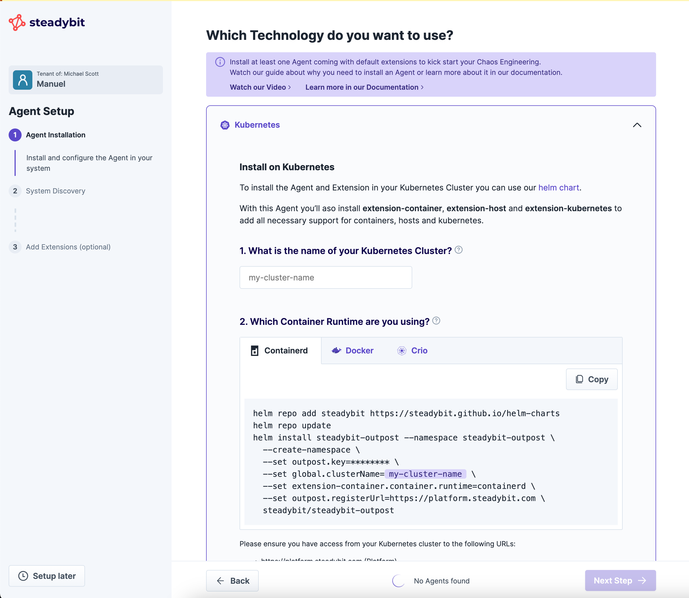
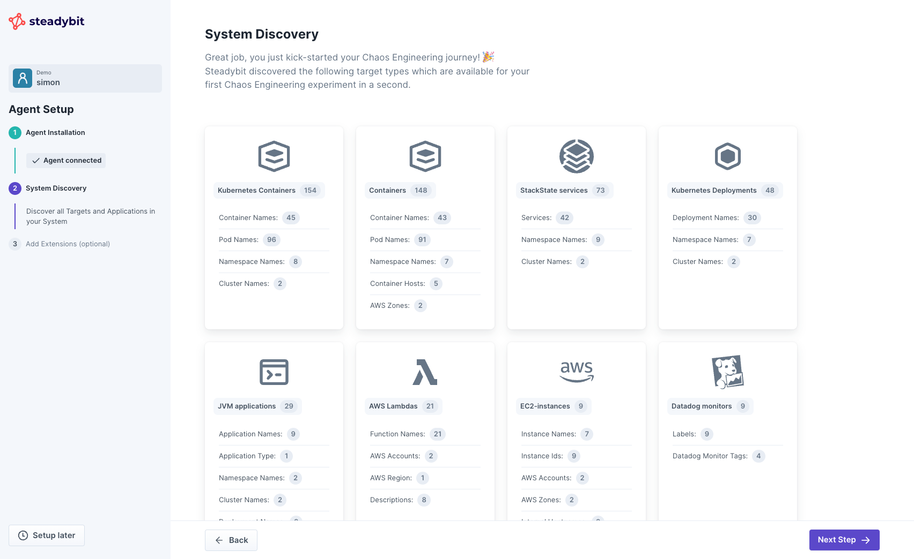
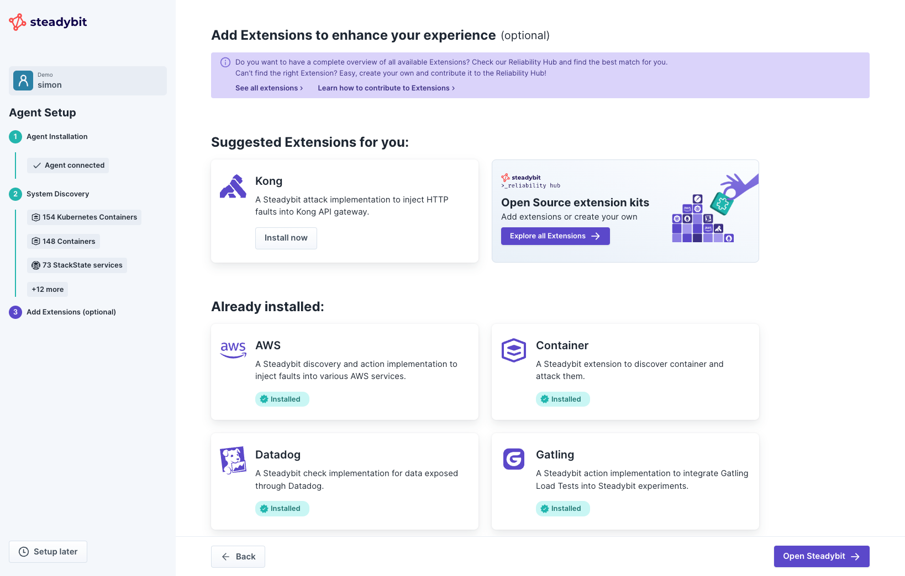

# Easy Start: Install Agents

This guide helps you with the initial setup of Steadybit by installing the agents.

In case something is not working out for you, [let us help you](https://www.steadybit.com/contact)!

### Prerequisite

* You have already signed up for an account [on our website](https://www.steadybit.com/get-started/)
* You are able to log in to the [Steadybit SaaS platform](https://platform.steadybit.io/)

### Step 1 - Install Agents

Our agents continuously discover and deliver target data to the platform and help you create targeted experiments based on data that is always up-to-date. Therefore, it is necessary that you deploy the agents to the locations in which you want to perform analyses and experiments.


Without agents, there is no discovery data and thus no experiments are possible.


We offer our agents for different platforms and have made the installation as easy as possible for you. You can find the different installation scripts directly in our platform after logging in.

Simply copy your agent key, replace it with the placeholder in the installation script and execute it next to your system. When using Kubernetes, we recommend using Helm.

> If you need a demo application to play around, you can [deploy our Shopping Demo into a Minikube or AWS EKS cluster](deploy-example-application.md).

Once an agent is rolled out, it connects to the platform and appears at the bottom of the page. This may take a few minutes. Afterwards, you are able to continue with the on-boarding by clicking continue.

### Step 2 - Let Steadybit discover your system

Now, the Steadybit Agent is busy discovering your system and gives you an overview what has been found. After completing initial discovery, you can open up Steadybit and are ready for use.

### Step 3 - Start using Steadybit!

That's it! You are welcomed by our Dashboard giving you access to all relevant information, and you are ready to take off.

Start using Steadybit by

* [defining your resilience expectations via policies](define-resilience-policies.md) for your services
* or by [designing and running your first experiment](run-experiment.md)
