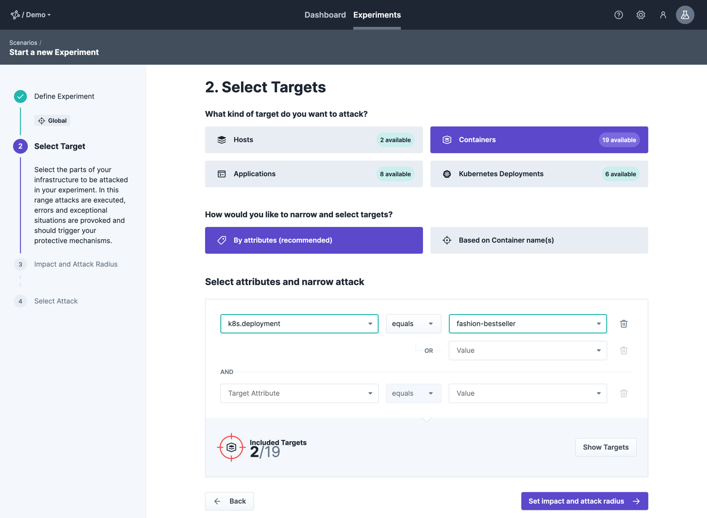
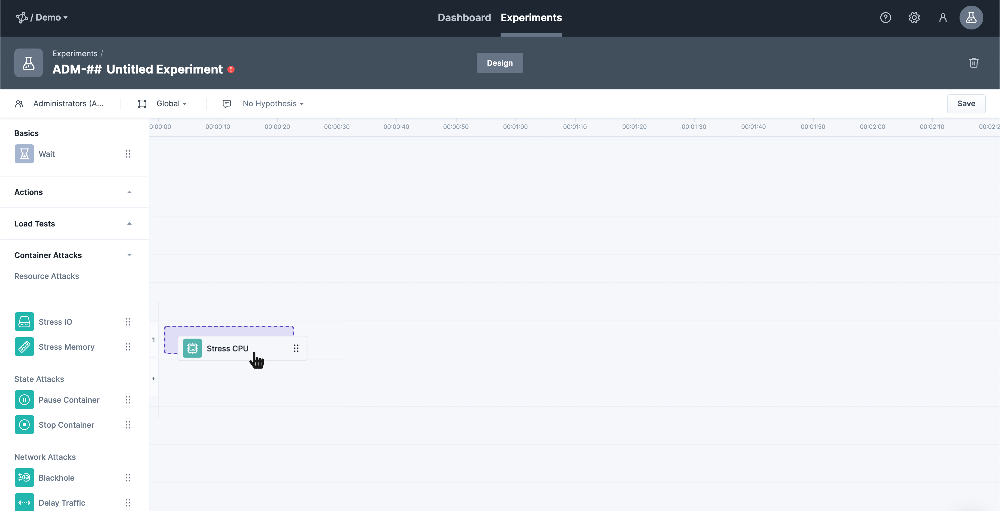
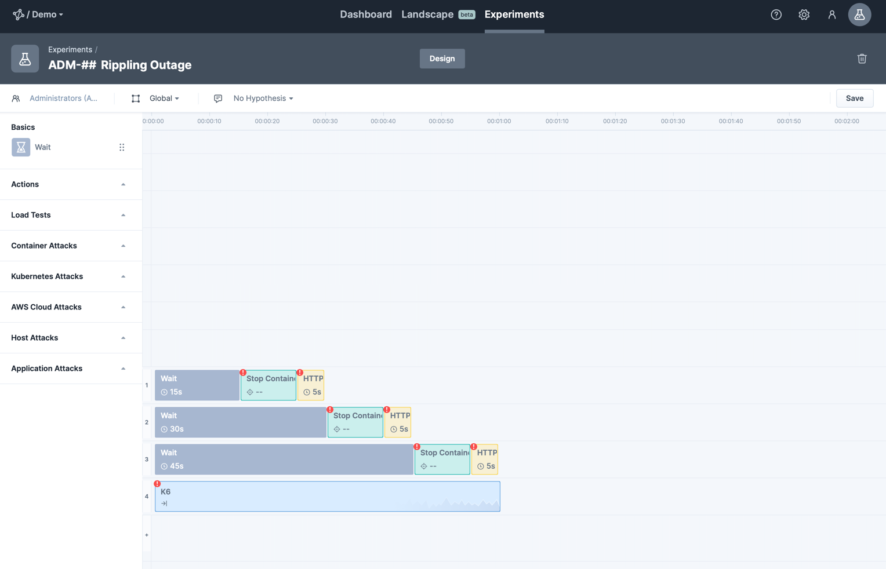
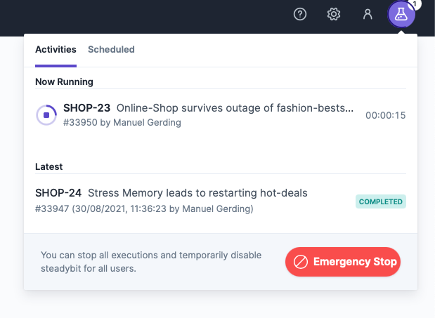

# Experiments

## Design

To get you started with an experiment you first need to design it. That means, defining e.g. where to execute it (environment, targets) and what should be done (attack, actions, checks).

In general, you have three possibilities to get started:

* **Wizard (guided creation)**: to create your first experiment in a simple and lightweight way
* **Blank**: in case you exactly know what to design and just need to get it done
* **Templates**: benefit from existing recipes and only apply them to your setup

Before going into each approach, let's cover the basic elements of an experiment.

#### Basic Elements

An experiment generally consists of the following elements:

* **Name**: Giving your experiment a meaningful name makes it easier to find it again, it can be changed at any time.
*   **Team**: Each experiment is associated with a team. In case you are member in more than one team you can change it at experiment creation time. After creation, it can not be changed.

    The team influences the experiment in the following aspects:

    1. **Short Handle:** Each experiment gets a unique key with team prefix (e.g. `SRE-23`) which can be used e.g. to trigger an experiment via the [API](../integrate/10-api/).
    2. **Run/Edit Permissions:** Only members of the associated team are permitted to edit or execute the experiment.
    3. **Attack/Target Permissions:** The team settings determine which attacks and/or targets are eligible for the experiment.
* **Hypothesis**: The hypothesis should answer the question of the expected outcome. In addition, you can describe the steady state, the turbulent condition and the expected behaviour. See this example of a hypothesis: _"When requests for the recommendation service exceeds 1000ms the catalog responds within 1000ms using an empty recommendation list."_
* **Environment**: An experiment is always executed in one specific environment of your system landscape. This environment spans a set of targets which you want to address in an experiment. For instance a set of containers and JVM applications of a Development environment. How the [environments are configured and assigned to your team](../install-configure/50-set-up-environments/) is up to your admin.

#### Design Experiment via Wizard

The wizard guides you step by step through the creation of the experiment. It consists of the following four steps:

1. **Define Experiment** First things first: Define the basic elements of the experiments like name, hypothesis and environment (see above).

1. **Select Target** For selecting the target you want to attack you need to select the target kind first. We support various target kinds like e.g. hosts, containers, JVM applications.

Our recommended way is to select them by attributes where you can use the [discovery data](../use/30-discovery/) to specify them with a dynamically evaluated query. Since these attributes are discovered by the agents and can change from one moment to the next, it is wise to choose stable attributes. Good examples are labels, namespaces or symbolic names - whereas a unique identifier of targets (like the container id) are usually a bad idea. When the experiment is due to be executed those attributes are resolved into a concrete set of targets to be attacked. You can use the "show targets" button next to the query to evaluate it's effect and preview matching targets.

As an alternative and more static approach you can also choose from a list based on names. For some target types (e.g. application) the target definition is always specified via the list as it is inherent stable.

1. **Impact and Attack Radius** You can limit your impact by defining an attack radius. It is a best practices to start easy and not by attacking your entire target selection. Therefore, specify the attack radius as a percentage or fixed number - limiting the amount of maximum affected e.g. hosts or containers. Even so, 100% is a valid value - but you need to be explicit about that.

1. **Select Attack** Now you are ready to choose a suitable attack from one of the available catgories to match your hypothesis. Choose the attack with the desired effect and the matching target type. If needed, you are able to provide additional settings for the attack. However, the defaults are usual a good way to go. To learn more about attacks, check out our [learn-attacks-section in the docs](../use/20-attacks/).

After saving the experiment you are ready to [run it directly](../use/10-experiments/20-run/) or extend it using our editor (see blank experiment).

#### Design Blank Experiment

When choosing to start by a blank experiment, you land directly into our experiment editor. In case your team has only access to one environment, it is automatically chosen. Otherwise you have to define in which environment you want to experiment. In addition, you can define the remaining basic elements (name and hypothesis) at any point you like.

After that, you can add attacks, actions, checks and load tests to your experiment by using drag'n drop.

As soon as the element is placed you can configure it on the right hand side. Specifying e.g. for an attack the target and attack radius (see previous section).

#### Design Experiment using Templates

The last option to define an experiment is using an existing template. This way, you only need to specify the targets but don't need to specify the sequence of the attacks.

Just click on each element to define e.g. for an attack the target and attack radius on the right hand side (see previous section).

#### Additional Elements

If you want to learn more about elements which can be added to the experiment, check out sections for

* adding [Load Tests](../integrate/20-loadtests/)
* integrating [Monitoring](../integrate/30-monitoring/)
* checking [HTTP calls](../use/15-actions/20-http-call/), [POD counts](../use/15-actions/10-pod-count/), [Prometheus Metrics](../use/15-actions/30-prometheus/) or our [Postman Integration](../use/15-actions/40-postman/).

## Run

After having your [experiment fully designed](../content/use/10-experiments/10-design/) you can simply use the `Run`-button to execute it. This action can be performed if all the following conditions are met:

1. No validation errors
2. Every attack resolves at that moment to at least one target.
3. You are member of the same team as the experiment
4. [Emergency stop](../content/use/10-experiments/30-prevent-execution/) has not been triggered.

Otherwise, you'll get an error message and the experiment is not started.

### Running an Experiment

As soon as the experiment starts, the platform automatically switches over to the execution view. The first step of the platform is to establish the connection to the matching agents. In addition, the running experiment is indicated at the top right execution icon.

.png>)

The execution view consists of the following elements.

* **Experiment Player**: At the top you see the sequence defined previously in the [design](../content/use/10-experiments/10-design/). While the experiment is running a special marker indicates the current point of time. Some attacks need a little bit of extra time before being started which is indicated by a light green colouring in the front. The extra time is added to the timing of the attack and is currently caused by technical reasons.
* **Execution Log**: The execution log lists more details to the experiment attacks and actions. For instance, you can see which exact containers are affected by the attack or what is the exact reason for a failed experiment
* **Deployment Replica Count**: When using an experiment in a Kubernetes context we will automatically monitor how many PODs are ready in your cluster and indicate whenever there is a discrepancy.
* **Kubernetes Event Log**: When using an experiment in a Kubernetes context we provide you access to the Kubernetes Events so that you can identify what exactly happens in the Kubernetes cluster.
* **HTTP Call**: If your experiment contains a `HTTP Call`-action you can see the response time as well as HTTP response status as a separate widget in the execution window.
* **Monitoring Events**: In case your admin has connected a monitoring solution to steadybit (like [Datadog](../content/integrate/30-monitoring/10-datadog/), [Instana](../content/integrate/30-monitoring/30-instana/), [New Relic](../content/integrate/30-monitoring/40-newrelic/) or [Prometheus](broken-reference)) you can see occuring events and alerts of your setup directly in the execution view.

Every execution has a unique identifier (e.g. **#33131**), which you can use to identify older executions (visible on the left side).

Eventually, every execution ends in one of the following states:

| End state | Description                                                                                                                                                                                                                                                |
| --------- | ---------------------------------------------------------------------------------------------------------------------------------------------------------------------------------------------------------------------------------------------------------- |
| COMPLETED | Entire experiment (all attacks, actions and checks) were successfully executed - so no failure reported by any check.                                                                                                                                      |
| CANCELED  | The experiment was canceled by user interaction and all attacks were rolled back.                                                                                                                                                                          |
| FAILED    | The execution failed due to some technical reasons like _Failed attack execution_ or _Agent disconnected unexpectedly_. This shouldn't happen frequently, in case it does, let us know. We are constantly improving the platform to reduce failure states. |

In case an agent looses the connection to the platform during an experiment, it will immediately stop and rollback running attacks. There are some attacks (like `Stop Container`) which can't be rolled back due to it's nature.

## Emergency Stop

In case a running experiment causes unforeseen severe failures every authenticated user can stop any running experiment by clicking the emergency stop button. You can find it in the activity bar at the top right.

After that, all running experiments will be stopped and in addition the execution of new experiments will be prevented (via UI as well as API).
