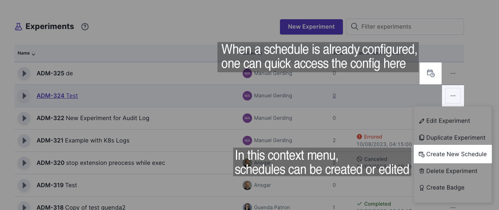
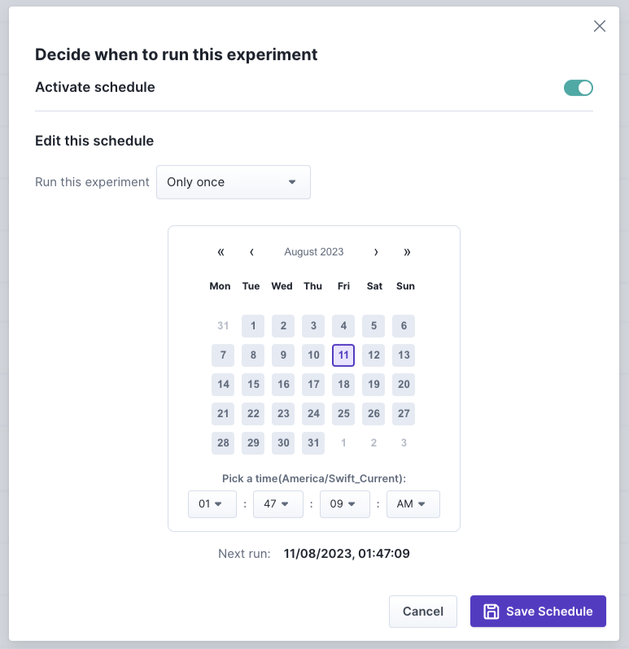

# Schedule Experiments

Experiments can be run on the fly using the “Run Experiment” button (or via API) but also can be scheduled to be automatically run in the future. Scheduling an experiment can be done in two fashions:

## Scheduling via UI

There are two buttons to open up the scheduling configuration dialog, which can be found in the product. One is in the experiment list, and the other one is in the experiment editor.

(In the experiment list, the scheduling can be configured through the context menu)

(In the experiment editor, the scheduling can be configured through the configure button on the top right)

### Note:

Please note that one must have permissions to edit the experiment in order to also schedule it.

### Fixed scheduling date

When the configuration dialog opens up, one can decide either to run the experiment just once in the future or repeatedly. The configuration is straightforward if you decide to run it once. Just select a date and time in the future and save the schedule. Please keep the “Activate Schedule” toggle enabled. Otherwise, the schedule will be ignored and not executed.

#### Note:

The date and time selections are done in the user’s configured timezone. The currently configured timezone will also be printed above the time selection for awareness.

### Repeating schedules

Experiments can be scheduled to run repeatedly (like every hour or every Friday morning). To do so, you have to configure a cron-like expression. **Just so you know**, we are using the [Quartz cron trigger syntax](http://www.quartz-scheduler.org/documentation/quartz-2.3.0/tutorials/crontrigger.html).

### Scheduling overview

In the experiment list section on the left-hand side, you can find a quick overview of all schedules which have been configured. Here, you can easily see when the schedules will be triggered next and en- and disable or even delete the schedule.

## Scheduling via API

Schedules can also be configured using the following API endpoints:

- [Create a new schedule](https://platform.steadybit.com/api/swagger/swagger-ui/index.html#/Experiments/scheduleExperimentOnce_1)
- [Update an existing schedule](https://platform.steadybit.com/api/swagger/swagger-ui/index.html#/Experiments/updateSchedule)
- [Get the current schedule configuration](https://platform.steadybit.com/api/swagger/swagger-ui/index.html#/Experiments/getSchedule)
- [Remove and existing schedule](https://platform.steadybit.com/api/swagger/swagger-ui/index.html#/Experiments/removeExperimentSchedule)
- [List all schedules currently configured](https://platform.steadybit.com/api/swagger/swagger-ui/index.html#/Experiments/getAllSchedules)
