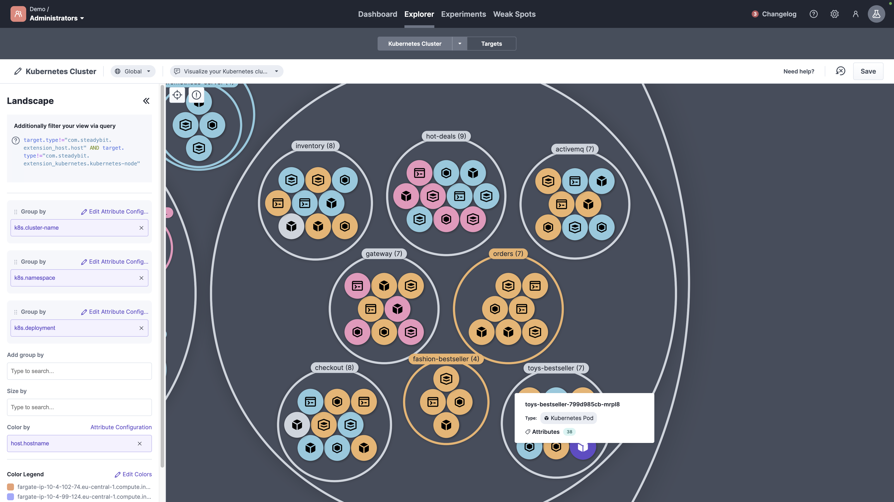
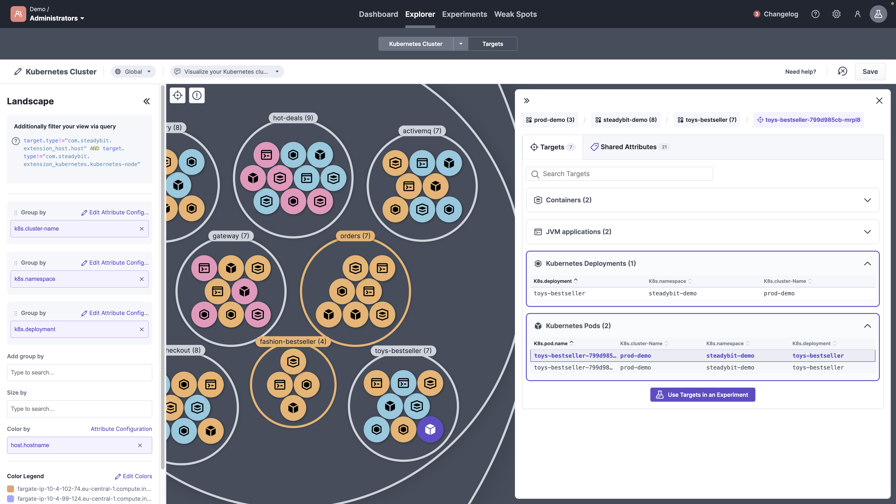
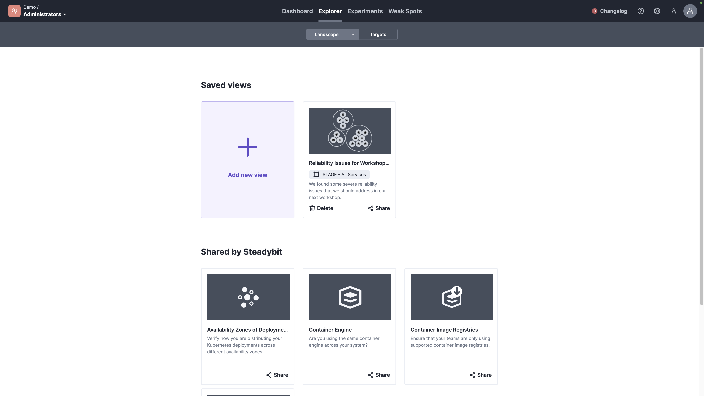

# Explorer Landscape
The Landscape informs your Chaos Engineering journey by being able to analyze the discovered infrastructure component in more detail.
You can easily navigate in potential targets and, e.g., search for new experiments that can be used to approach a team or verify whether other components may be affected by a revealed reliability issue.

## Drill-Down Targets
When using the Landscape, you have the following capabilities at your hand to better understand discovered targets

- **Environment** to define the upper amount of targets that you would like to explore
- **Filter targets via Query** to include targets you are interested in and exclude all targets that do not match
- **Group by** to group targets by an attribute value and bring them next to each other. You can even do endless subgroupings.
- **Size by** to analyze the target's attributes that have multiple different values assigned
- **Color by** to highlight and differentiate attribute's values

For every target or group of targets, you can view the discovered target types and attributes.

## Advice
Once you activate the 'Show Advice' in the sidebar, the targets are colored depending on the worst advice state (see [Advice Lifecycle](advice.md#advice-lifecycle)).
You can see more details for each target by opening up the target sidebar or target details.

Learn more about [advice](advice.md) in the corresponding section.

## Create Experiments
Once you have identified a relevant group of targets for an experiment, you can click on that group and choose to use the target selection for an experiment.
The Landscape provides the exact Query so that you can copy it into an experiment design.

## Saved Views
You can save all views you have created with the Landscape to share them automatically with your team members.
In addition, you can always share a view with someone else using a deep link to that particular view.
Whenever you have made changes to a saved view, the Landscape will ask you whether you want to keep them or you can save them as a new view.

In addition, Steadybit shares some predefined views that will help you to get started with the Landscape.
They are dependent on the actual discovered targets, showing e.g. a Kubernetes map only when at least one Kubernetes cluster is discovered.

