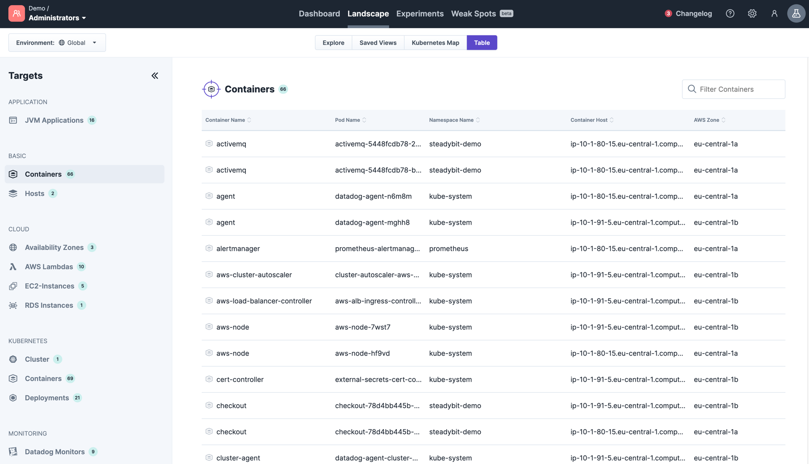
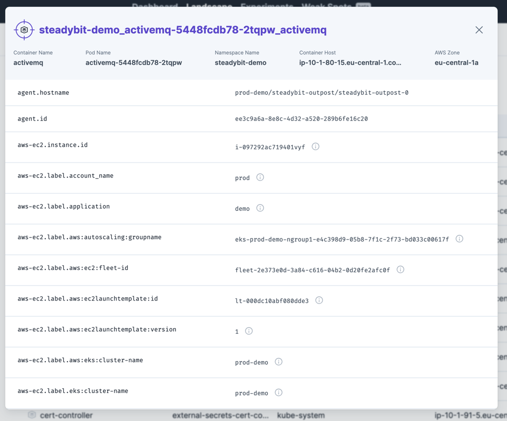
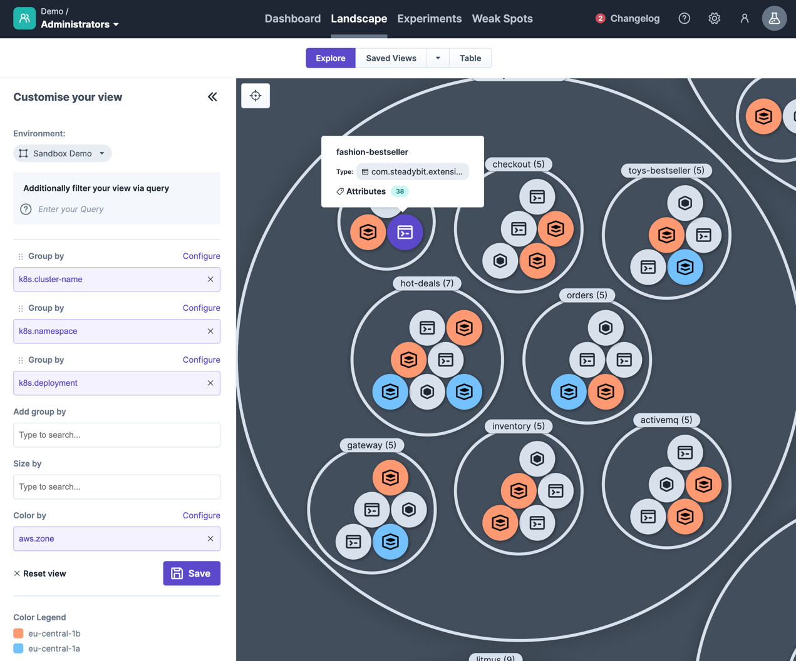
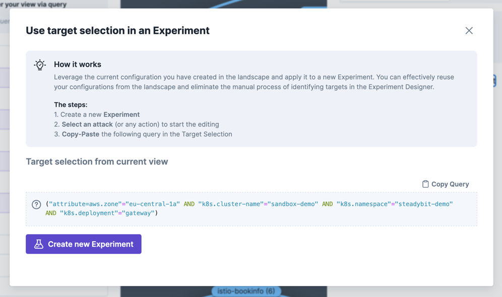

# Landscape

Steadybit's landscape shows you an overview of all targets discovered by extensions.
You can choose between viewing the discovered targets on a table or doing an extensive exploration using the Explorer.

## Table
The landscape table gives you an overview of all targets to check, e.g., for completeness of targets or whether a newly installed extension discovers the appropriate target type. You can always see the full details of a target by clicking on it.
Depending on your team's permission, you can see the environment Global to see all discovered targets or choose a specific environment to list targets according to your permissions.

## Explorer
The Explorer informs your Chaos Engineering journey by being able to analyze the discovered infrastructure component in more detail.
You can easily navigate in potential targets and, e.g., search for new experiments that can be used to approach a team or verify whether other components may be affected by a revealed reliability issue.
When using the Explorer, you have the following capabilities at your hand

- **Environment** to define the upper amount of targets that you would like to explore
- **Filter targets via Query** to include targets you are interested in and exclude all targets that do not match
- **Group by** to group targets by an attribute value and bring them next to each other. You can even do endless subgroupings.
- **Size by** to analyze the target's attributes that have multiple different values assigned
- **Color by** to highlight and differentiate attribute's values

For every target or group of targets, you can view the discovered attributes and the shared attributes that are in common with the related parent.

### Create Experiments
Once you have identified a relevant group of targets for an experiment, you can click on that group and choose to use the target selection for an experiment. The Explorer provides the exact Query so that you can copy it into an experiment design.

## Saved Views
You can save all views you have created with the Explorer to share them automatically with your team members.
In addition, you can always share a view with someone else using a deep link to that particular view.
Whenever you have made changes to a saved view, the Explorer will ask you whether you want to keep them or you can save them as a new view.

In addition, Steadybit shares some predefined views that will help you to get started with the Explorer.
They are dependent on the actual discovered targets, showing e.g. a Kubernetes map only when at least one Kubernetes cluster is discovered.

